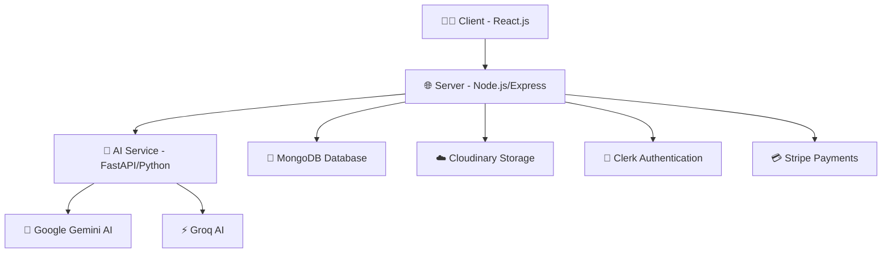

# 🎓 SkillNest LMS - Intelligent Learning Management System

<div align="center">


**Empowering Education with AI-Driven Learning Solutions**

[](https://skillnest-lms.tech)
[](https://skill-nest-lms.vercel.app)
[](https://skillnest-ai-service.onrender.com)

</div>

---

## 🚀 **Project Overview**

SkillNest LMS is a cutting-edge Learning Management System that combines traditional educational tools with advanced AI capabilities. Built with a modern microservices architecture, it delivers personalized learning experiences through intelligent features like automated quiz generation, AI-powered chatbot assistance, and smart video content analysis.

### 🌟 **Key Highlights**

- 🤖 **AI-Powered Learning**: Integrated Bobby AI Chatbot for 24/7 student support
- 📝 **Smart Quiz Generation**: Automated quiz creation using Google Gemini
- 🎥 **Video Intelligence**: AI-driven video summarization and Q&A
- 📱 **Responsive Design**: Seamless experience across all devices
- 🔐 **Secure Authentication**: Clerk-powered user management
- ⚡ **Real-time Features**: Live updates and notifications
- 🏗️ **Microservices Architecture**: Scalable and maintainable codebase

---

## 🏛️ **System Architecture**



### 📁 **Project Structure**

```
skillnest-lms/
├── 📱 client/          # React.js Frontend (Vercel)
├── 🖥️  server/          # Node.js Backend (Vercel)
└── 🧠 ai-service/      # Python AI Microservice (Render)
```

---

## 🛠️ **Technology Stack**

<div align="center">

### **Frontend**


### **Backend**


### **AI Services**


### **Cloud & Deployment**


</div>

---

## ✨ **Features**

### 👨‍🎓 **For Students**
- 📚 **Course Enrollment**: Browse and enroll in courses seamlessly
- 🎥 **Video Player**: Enhanced learning with integrated video content
- 📊 **Progress Tracking**: Monitor learning progress and achievements
- 🤖 **Bobby AI Assistant**: Get instant help and answers to your questions
- 📝 **AI-Generated Quizzes**: Practice with intelligent assessments
- 📱 **Mobile Responsive**: Learn anywhere, anytime

### 👨‍🏫 **For Educators**
- 📋 **Course Management**: Create, edit, and organize courses effortlessly
- 👥 **Student Analytics**: Track enrollment and student progress
- 📊 **Dashboard**: Comprehensive overview of teaching activities
- 🎯 **Content Creation**: Rich text editor with multimedia support
- 📈 **Performance Insights**: Analyze student engagement and success

### 🤖 **AI-Powered Features**
- **Bobby Chatbot**: Intelligent conversational AI for student support
- **Quiz Generator**: Auto-create quizzes from course content using Gemini AI
- **Video AI**: Summarize videos and answer questions about content
- **Smart Recommendations**: Personalized learning path suggestions

---

## 🚀 **Quick Start**

### **Prerequisites**
- Node.js 18+ and npm/yarn
- Python 3.8+ and pip
- MongoDB database
- API keys for Clerk, Cloudinary, Stripe, Google Gemini, and Groq

### **1. Clone the Repository**
```bash
git clone https://github.com/yourusername/skillnest-lms.git
cd skillnest-lms
```

### **2. Frontend Setup**
```bash
cd client
npm install
cp .env.example .env.local
# Add your environment variables
npm run dev
```

### **3. Backend Setup**
```bash
cd server
npm install
cp .env.example .env
# Configure your environment variables
npm run dev
```

### **4. AI Service Setup**
```bash
cd ai-service
pip install -r requirements.txt
cp .env.example .env
# Add your AI API keys
python main.py
```

---

## 🌐 **Environment Variables**

### **Client (.env.local)**
```env
VITE_CLERK_PUBLISHABLE_KEY=your_clerk_key
VITE_BACKEND_URL=your_backend_url
VITE_AI_SERVICE_URL=your_ai_service_url
```

### **Server (.env)**
```env
MONGODB_URI=your_mongodb_connection
CLOUDINARY_NAME=your_cloudinary_name
CLOUDINARY_API_KEY=your_cloudinary_key
CLOUDINARY_API_SECRET=your_cloudinary_secret
CLERK_WEBHOOK_SECRET=your_clerk_webhook_secret
STRIPE_SECRET_KEY=your_stripe_secret
AI_SERVICE_URL=your_ai_service_url
```

### **AI Service (.env)**
```env
GOOGLE_API_KEY=your_gemini_api_key
GROQ_API_KEY=your_groq_api_key
MONGODB_URI=your_mongodb_connection
```

---

## 📋 **API Endpoints**

### **Core APIs**
- `GET /api/health` - System health check
- `POST /api/user/*` - User management
- `POST /api/course/*` - Course operations
- `POST /api/educator/*` - Educator dashboard

### **AI Services**
- `POST /api/ai/generate-quiz` - Generate AI quizzes
- `POST /api/chatbot/chat` - Bobby AI conversations
- `POST /api/video-ai/summarize` - Video content summarization
- `POST /api/video-ai/ask-question` - Video Q&A

---

## 🎯 **Roadmap & Future Enhancements**

- [ ] 🧠 **Advanced AI Analytics** - Learning pattern analysis
- [ ] 🌍 **Multi-language Support** - Global accessibility
- [ ] 📊 **Advanced Reporting** - Detailed performance metrics
- [ ] 🎮 **Gamification** - Points, badges, and leaderboards
- [ ] 📱 **Mobile App** - Native iOS and Android apps
- [ ] 🔌 **Plugin System** - Extensible third-party integrations

---

## 🤝 **Contributing**

1. Fork the repository
2. Create your feature branch (`git checkout -b feature/AmazingFeature`)
3. Commit your changes (`git commit -m 'Add some AmazingFeature'`)
4. Push to the branch (`git push origin feature/AmazingFeature`)
5. Open a Pull Request

---


**Built with ❤️ by the SkillNest Team**

[](https://github.com/AkhilRaawat)
[](https://www.linkedin.com/in/akhil-rawat)

</div>

---

## 📞 **Support**

Need help? We're here for you!

- 📧 **Email**: akhilrawat155@gmail.com
- 🐛 **Bug Reports**: [Create an issue](https://github.com/yourusername/skillnest-lms/issues)

---

<div align="center">

### ⭐ **Star this repo if you found it helpful!**

[](https://github.com/AkhilRaawat/skillnest-lms/stargazers)
[](https://github.com/AkhilRaawat/skillnest-lms/network/members)

**Made with 💻 and ☕ | © 2025 SkillNest LMS**

</div>
